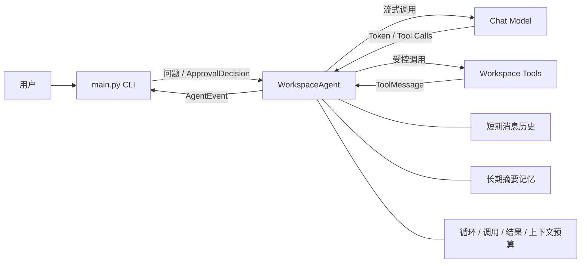

# LangChain 通用 Agent 学习项目：进度总结与开发路线图

> 更新日期：2026-07-23  
> 当前阶段：自研 Agent 核心循环与安全工具执行已经完成，准备进入协议解耦和持久化阶段  
> 当前测试基线：`36 passed`

## 1. 项目目标

这个项目不是单纯调用一次大模型，而是在逐步实现一个可复用、可测试、可扩展的工作区 Agent。

最终希望它具备以下能力：

- 与大模型进行流式对话；
- 由模型自主选择和调用工具；
- 安全地读取、搜索和修改工作区文件；
- 控制循环次数、工具次数、上下文和结果体积；
- 在上下文被裁剪后保留长期记忆；
- 对有副作用的操作进行人工审批；
- 在取消、异常和冲突发生时保持状态一致；
- 支持会话持久化、可观测性、知识库检索和服务化部署。

当前项目已经从“能调用工具的聊天程序”发展为一个具备事务、安全边界和人工审批协议的 Agent 内核。

## 2. 当前代码结构

| 文件 | 当前职责 |
| --- | --- |
| `main.py` | CLI 输入、流式事件渲染、人工审批交互、模型与工具装配 |
| `agent.py` | Agent 循环、消息历史、工具调度、预算、长期记忆、事务提交和审批协议 |
| `tools.py` | 工作区路径保护、文件读取、目录查看、文本搜索、安全写入和写入预览 |
| `tests/test_agent.py` | Agent 行为、事务、预算、记忆、审批和写入冲突测试 |
| `tests/test_tools.py` | 文件工具边界、分页、大小限制和敏感路径测试 |
| `pytest.ini` | pytest 环境隔离配置 |

当前运行关系如下：



## 3. 已完成的能力

### 3.1 基础对话与流式输出

- 已接入 LangChain Chat Model。
- 模型输出可以逐 token 流式显示。
- 工具调用结束后，模型可以继续流式生成最终回答。
- CLI 只负责输入和渲染，不承担 Agent 推理逻辑。

这一阶段已经掌握：

- `bind_tools()` 的基本使用；
- `AIMessageChunk` 到完整消息的转换；
- 工具调用消息和普通文本消息的区别；
- 流式生成与最终消息提交之间的关系。

### 3.2 多轮 Agent 工具循环

- 模型可以连续执行“思考 → 调用工具 → 获取结果 → 再思考”。
- 默认最多进行 5 轮 Agent 循环。
- 支持同一轮中的多个工具调用。
- 最后一轮会禁用工具，强制模型收尾。
- 空响应和循环耗尽会产生明确的系统事件。

已经实现多层循环保护：

- 最大 Agent 循环数；
- 最大工具调用次数；
- 重复工具调用检测；
- 最后一轮禁止继续调用工具；
- 工具结果累计字符预算。

### 3.3 事件驱动的 Agent 内核

`WorkspaceAgent.stream_turn()` 是一个双向生成器。它向调用方产生不可变事件，并可通过 `.send()` 接收审批决定。

当前事件包括：

- `TokenEvent`
- `ToolCallEvent`
- `ToolResultEvent`
- `ApprovalRequiredEvent`
- `SystemEvent`
- `ContextTrimmedEvent`
- `MemoryUpdatedEvent`

当前事件边界具备以下特点：

- `agent.py` 不直接使用终端输入输出；
- 工具结果正文只进入 `ToolMessage`；
- `ToolResultEvent` 只暴露状态、字符数和安全摘要；
- 工具参数进入事件前会被冻结；
- `content`、`api_key`、`password`、`secret`、`token` 等参数会被脱敏。

这意味着 Agent 内核已经可以脱离 CLI，被其他界面或服务复用。

### 3.4 事务式消息历史

每轮对话使用临时的 `working_messages`：

1. 从已提交历史构建本轮工作状态；
2. 模型和工具只修改工作状态；
3. 只有模型成功给出最终回答后才提交；
4. 取消事件流、异常退出或未完成回答时全部回滚。

同时使用实例锁保证：

- 同一个 `WorkspaceAgent` 不会并发运行两个轮次；
- 事件流关闭后锁一定释放；
- 不同 Agent 实例之间不共享消息历史。

### 3.5 安全的工作区文件工具

当前工具包括：

- `list_files`
- `read_file`
- `search_text`
- `write_file`

路径安全措施包括：

- 拒绝 POSIX 和 Windows 绝对路径；
- 拒绝 `..` 路径穿越；
- 使用 `resolve()` 和 `relative_to()` 防止符号链接逃逸；
- 屏蔽 `.env`、私钥、证书和常见隐藏依赖目录；
- 写入时要求父目录已经存在；
- 读写范围始终限制在工作区内。

资源限制包括：

| 能力 | 当前限制 |
| --- | --- |
| 单个可读取或搜索文件 | 最大 1 MB |
| `read_file` 单次读取 | 最大 200 行 |
| `read_file` 单次输出 | 最大 20,000 字符 |
| `list_files` | 最大 200 项 |
| `search_text` | 最大 50 条结果 |
| 单次写入内容 | 最大 1 MB |
| 写入 diff 预览 | 最大 8,000 字符 |

### 3.6 上下文管理

- 默认上下文预算为约 6,000 tokens。
- 每轮调用模型前使用 `trim_messages()` 构建上下文。
- 系统消息和当前问题必须保留。
- 不截断单条消息正文。
- `AIMessage(tool_calls)` 和对应 `ToolMessage` 按完整协议组保留或删除。
- 必要上下文本身超预算时，不调用模型，也不提交历史。
- 发生裁剪时产生 `ContextTrimmedEvent`。

### 3.7 长期摘要记忆

- 被裁剪的完整旧轮次可以更新 `memory_summary`。
- 支持注入独立的 `summary_model`。
- 默认摘要模型使用未绑定工具的原始模型。
- 已有摘要参与后续摘要合并。
- 摘要不会包含原始 `ToolMessage` 或纯工具调用消息。
- 摘要长度受限，并会根据当前上下文预算缩短或临时省略。
- 摘要失败不会阻止当前正常回答。
- 只有最终回答成功后才提交摘要。
- 取消事件流不会提交摘要，也不会产生错误的记忆更新事件。

### 3.8 工具结果预算

- 默认每轮最多接收 12,000 个真实工具结果字符。
- 单个超大结果会被截断并添加明确标记。
- 并行工具调用共享同一个累计预算。
- 预算耗尽后，同批剩余工具调用会被跳过。
- 工具异常文本同样计入预算。
- 权限、重复、次数限制等控制消息不占真实结果预算。
- 预算耗尽后使用无工具模型强制收尾。

### 3.9 人工审批

- 可以通过 `approval_required_tools` 指定必须审批的工具。
- Agent 通过 `ApprovalRequiredEvent` 暂停执行。
- CLI 使用生成器 `.send(ApprovalDecision(...))` 恢复事件流。
- 只有调用 ID 匹配且明确批准时才执行工具。
- 拒绝、缺失决定、错误 ID 和关闭事件流全部 fail-closed。
- 审批未完成时关闭事件流不会提交消息历史。

### 3.10 安全原子写入

`write_file` 当前具备：

- 工作区和敏感路径校验；
- UTF-8 文本与 1 MB 大小限制；
- 统一 diff 审批预览；
- 同目录临时文件写入；
- `flush()` 与 `fsync()`；
- `os.replace()` 原子替换；
- 失败后的临时文件清理；
- 覆盖已有文件时保留原权限，例如脚本的 `0755`。

### 3.11 审批快照与冲突检测

为了确保“用户批准的内容就是实际执行的内容”，已经加入 `PreparedToolAction`：

1. 生成预览时记录文件是否存在；
2. 对已有文件记录内容 SHA-256；
3. 用户批准后重新校验文件状态；
4. 临时文件完成后、原子替换前再次校验；
5. 文件被修改、删除或抢先创建时拒绝覆盖；
6. 冲突转为失败的 `ToolResultEvent` 和非空 `ToolMessage`；
7. 外部程序产生的修改会被保留。

这是乐观并发控制。第二次校验和 `os.replace()` 之间仍存在极小的系统级竞争窗口；在当前单机文本工作区场景中可以接受。如果未来需要跨进程强一致写入，应引入操作系统文件锁、存储层版本号或支持 Compare-And-Swap 的后端。

## 4. 当前测试覆盖

当前完整测试结果：

```text
36 passed
```

主要覆盖范围：

| 分类 | 已覆盖行为 |
| --- | --- |
| 基础回答 | 直接回答、工具调用后回答 |
| 事务 | 取消回滚、锁释放、实例隔离 |
| 工具协议 | 完整工具消息组、重复调用、最后一轮收尾 |
| 调用预算 | 工具次数、结果字符、并行共享预算 |
| 上下文 | 裁剪、必要消息保留、超预算拒绝 |
| 长期记忆 | 摘要合并、上下文注入、失败降级、取消回滚 |
| 审批 | 批准、拒绝、错误调用 ID、等待时关闭 |
| 安全写入 | 创建、覆盖、预览、权限保持、敏感路径拒绝 |
| 并发冲突 | 已有文件变化、新文件被抢先创建、无冲突写入 |
| 文件工具 | 分页、行号、输出限制、大文件和敏感文件保护 |

现阶段测试主要使用确定性的 `ScriptedModel`，不会依赖真实网络模型，因此运行速度快、结果稳定。

## 5. 当前阶段掌握的核心知识

到这里，已经实际接触并实现了通用 Agent 开发中最重要的一批基础概念：

- LangChain 消息协议；
- 模型流式输出；
- Tool Calling；
- 自定义 Agent 循环；
- 并行工具调用；
- 事件驱动接口；
- 双向生成器；
- 事务提交与回滚；
- 短期上下文裁剪；
- 长期摘要记忆；
- 工具调用与结果预算；
- 参数脱敏；
- Human-in-the-loop；
- 原子文件替换；
- 审批与执行之间的乐观并发控制；
- 使用测试替代真实模型验证 Agent 状态机。

目前最有价值的成果不是 CLI 界面，而是已经形成了一个可以被 CLI、Web API 或其他 UI 驱动的 Agent 内核。

## 6. 当前遗留问题与有意保留的限制

### 6.1 需要优先处理的架构问题

- `PreparedToolAction` 和冲突异常定义在 `agent.py`，导致 `tools.py` 反向依赖 Agent 实现。
- `approval_previewers` 同时可能返回字符串或已准备操作，接口语义不够严格。
- 事件、审批协议和 Agent 实现仍集中在同一文件中。

这些问题不会破坏当前功能，但会增加后续持久化、Web 接口和更多写工具的耦合。

### 6.2 会话只存在于内存

- 程序退出后消息历史和长期摘要都会丢失；
- 目前不能选择或恢复多个会话；
- 等待审批的执行状态不能跨进程恢复。

### 6.3 缺少完整可观测性

目前只有面向终端的事件显示，还缺少：

- `run_id`、`turn_id` 和 trace 关联；
- 模型与工具耗时；
- token 使用量和估算成本；
- 可持久化且经过脱敏的结构化审计日志；
- 错误类型和重试次数统计。

### 6.4 工具能力仍然有限

当前工具足够验证 Agent 架构，但还没有：

- 精确的局部文件编辑或补丁工具；
- Git 只读检查工具；
- 语义检索工具；
- 外部 API 工具；
- 工具级超时、重试和熔断策略。

暂时不加入任意 Shell 执行、任意删除和任意网络请求是合理的安全限制，不应仅为了“功能更多”而提前开放。

### 6.5 尚未服务化

- 当前只有同步 CLI；
- 还没有异步事件流；
- 没有 FastAPI、SSE 或 WebSocket 接口；
- 审批仍依赖终端输入；
- 没有身份、会话所有权和多用户隔离。

### 6.6 工程化配置尚不完整

- 依赖尚未通过 `pyproject.toml` 或锁文件固化；
- 缺少静态检查、格式化和类型检查配置；
- 缺少 CI；
- 当前核心文件存在尚未提交的工作区修改，适合在下一个稳定节点建立 Git 里程碑。

## 7. 后续开发路线

以下顺序遵循“先稳定协议，再持久化状态，随后增加能力，最后服务化”的原则。

### 目标 11.4：审批协议解耦与接口收紧

状态：**下一步**

开发内容：

- 新建 `contracts.py`；
- 将事件、`ApprovalDecision`、`PreparedToolAction` 和冲突异常移入协议层；
- `agent.py` 和 `tools.py` 共同依赖协议层，`tools.py` 不再依赖 `agent.py`；
- 将 `approval_previewers` 和 `approval_preparers` 拆成两个严格接口；
- 同一工具不能同时配置 previewer 和 preparer；
- preparer 返回类型错误时 fail-closed；
- 保持现有行为和导入兼容性。

建议测试：

- 同一工具配置两类处理器时构造失败；
- preparer 返回错误类型时不审批、不执行工具；
- 原有 36 项测试继续通过。

完成标准：至少 `38 passed`。

这一关主要学习依赖方向、协议层设计和 fail-closed API。

### 目标 12：会话持久化与恢复

#### 目标 12.1：版本化状态快照

- 使用 LangChain 的 `messages_to_dict()` 和 `messages_from_dict()`；
- 提供 `export_snapshot()` 和 `restore_snapshot()`；
- 快照包含版本号、已提交消息和长期摘要；
- 不包含模型、工具、锁、API Key 或本轮临时状态；
- 导出结果必须可以被 `json.dumps()`；
- 恢复时先完整验证，再一次性提交；
- 无效版本、损坏消息协议或超长摘要不能改变现有状态；
- 活跃事件流期间禁止导出或恢复。

#### 目标 12.2：安全的本地会话仓库

- 将快照原子写入工作区专用会话目录；
- 支持创建、列出、加载和删除命名会话；
- 校验会话 ID，防止路径穿越；
- 损坏文件返回明确错误；
- 保留最近一次有效快照；
- 会话文件不进入模型可自由访问的普通文件范围。

#### 目标 12.3：可恢复的审批中断

- 将待审批工具、调用 ID、脱敏参数和准备状态显式建模；
- 进程重启后可以显示待审批任务；
- 不直接序列化 Python 闭包；
- 恢复时重新准备预览并重新校验快照；
- 旧审批不能授权状态已经变化的新操作。

这一阶段完成后，Agent 才真正具备“程序退出后继续工作”的能力。

### 目标 13：可观测性与审计

#### 目标 13.1：运行标识

- 为会话、轮次、模型调用和工具调用生成稳定 ID；
- 所有事件携带必要的关联 ID；
- 同一轮的模型和工具行为可以被完整串联。

#### 目标 13.2：指标事件

- 记录模型耗时、首 token 延迟和总耗时；
- 记录输入/输出 token；
- 在模型支持 usage metadata 时使用真实值，否则明确标注估算值；
- 记录工具耗时、结果大小和错误类型。

#### 目标 13.3：结构化审计日志

- 使用 JSON Lines 保存事件；
- 写入前统一脱敏；
- 不记录完整文件内容、密钥和原始工具结果；
- 日志写入失败不能破坏正常问答；
- 测试日志中不存在敏感参数。

### 目标 14：知识库与 RAG

#### 目标 14.1：文档索引

- 读取 `docs/` 下受支持的文档；
- 文本分块并记录来源、文件路径和行号；
- 建立可重复更新的向量索引；
- 文件变化后只更新受影响的分块。

#### 目标 14.2：检索工具

- 新增语义检索工具；
- 返回有限数量的片段及来源；
- 对结果字符数和 token 数设置预算；
- 模型回答时必须提供可定位的来源。

#### 目标 14.3：检索评测

- 建立固定问题集；
- 分别评估召回、答案正确性和引用准确性；
- 对比纯关键词搜索与向量检索；
- 防止文档中的提示注入内容获得系统权限。

这一阶段重点学习 Retriever、Embedding、Vector Store、元数据和 RAG 评测。

### 目标 15：通用工具执行中间件

- 将权限、审批、重复检测、调用预算、结果预算、超时和重试整理为统一执行管线；
- 为工具声明只读、写入、外部副作用等风险等级；
- 只对明确可重试的错误进行有限重试；
- 每次重试仍受总预算约束；
- 写工具不能因为重试而重复产生副作用；
- 工具注册时校验名称冲突和策略缺失。

这一阶段会把目前集中在 `_execute_tool_call()` 中的逻辑拆成可组合策略。

### 目标 16：迁移到 LangGraph

在手写 Agent 循环已经吃透之后，再使用 LangGraph 重建相同能力：

- 将模型调用、工具执行、审批和收尾建模为图节点；
- 使用显式 State 替代隐含的局部变量；
- 使用 conditional edge 表达工具分支；
- 使用 interrupt 实现审批暂停；
- 使用 checkpointer 实现持久化；
- 将现有测试作为迁移前后的行为契约。

不要一开始就删除当前 `WorkspaceAgent`。建议先让两套实现共享事件和工具协议，并运行相同的契约测试，再逐步替换。

这一阶段的目标不是“为了使用 LangGraph 而使用 LangGraph”，而是理解：

- 手写循环中的每一个状态如何映射为图状态；
- 事务提交如何映射为 checkpoint；
- 双向生成器审批如何映射为 interrupt/resume；
- 自定义预算如何保留在图执行过程中。

### 目标 17：异步化与 Web 服务

#### 目标 17.1：异步 Agent 接口

- 增加 `astream_turn()`；
- 支持异步模型和异步工具；
- 正确处理客户端取消；
- 不阻塞事件循环；
- 同一会话仍保持串行事务。

#### 目标 17.2：FastAPI + SSE

- 提供创建会话和发送问题的 API；
- 使用 SSE 输出 Agent 事件；
- 审批通过独立 API 提交；
- 客户端断开时取消未完成轮次；
- 事件协议继续复用 `contracts.py`。

#### 目标 17.3：多用户隔离

- 会话绑定用户身份；
- 用户只能读取和恢复自己的会话；
- 工作区和审批权限按用户隔离；
- 增加限流、请求大小和并发限制。

### 目标 18：评测与生产化

- 建立工具选择、回答正确性、审批安全和提示注入测试集；
- 增加真实模型的可选集成测试；
- 固化依赖版本；
- 配置格式化、静态检查和类型检查；
- 建立 CI；
- 增加超时、退避、熔断和优雅退出；
- 制定日志保留、会话清理和密钥管理策略；
- 对成本、延迟和失败率建立发布门槛。

## 8. 推荐里程碑

| 里程碑 | 包含目标 | 可交付结果 |
| --- | --- | --- |
| M1：安全 Agent 内核 | 已完成至 11.3 | 可流式调用安全文件工具，并支持审批、预算和事务回滚 |
| M2：稳定协议与持久化 | 11.4、12 | 会话可以安全保存、恢复并跨进程继续 |
| M3：可观测 Agent | 13 | 每次模型和工具行为可追踪、可审计、可统计 |
| M4：知识工作区 Agent | 14、15 | 支持带来源的语义检索和可组合工具策略 |
| M5：LangGraph Agent | 16 | 使用图状态、checkpoint 和 interrupt 复现既有行为 |
| M6：可部署 Agent 服务 | 17、18 | 支持异步 Web 客户端、多用户隔离、评测和 CI |

## 9. 最近三步的建议执行顺序

不要同时铺开所有方向。建议严格按以下顺序推进：

1. **完成目标 11.4**：消除 `tools.py → agent.py` 的反向依赖，固定审批协议。
2. **完成目标 12.1**：只实现内存快照导出和恢复，不急着写磁盘。
3. **完成目标 12.2**：在快照格式稳定后，再实现原子文件存储和多会话管理。

每一关继续沿用当前节奏：

```text
明确行为边界
    ↓
先写确定性测试
    ↓
实现最小功能
    ↓
运行完整回归测试
    ↓
检查异常、取消和安全分支
    ↓
建立 Git 里程碑
```

## 10. 当前常用命令

```bash
# 激活虚拟环境
source .venv/bin/activate

# 运行 CLI Agent
python main.py

# 运行完整测试
python -m pytest -q
```

## 11. 当前阶段结论

当前项目已经完成了 Agent 开发中最容易被忽略、但最重要的底层部分：消息协议、工具循环、流式事件、状态事务、预算控制、上下文管理、长期记忆、安全边界和人工审批。

下一阶段不应该立即堆叠更多高权限工具。更合理的路线是先解耦协议并实现可靠持久化，然后加入可观测性和 RAG，最后再迁移到 LangGraph 和 Web 服务。

只要继续保持“一个目标、明确验收、确定性测试、完整回归”的节奏，这个工作区最终可以形成一个结构清晰、行为可验证的通用 Agent 项目，而不仅是一组 LangChain API 示例。
